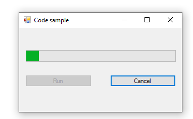

# About

Code samples for showing basics on working with asynchronous task with option to cancellation a task in Windows Form projects for both VB.NET and C#.

### Requires
Microsoft Visual Studio 2017 or higher